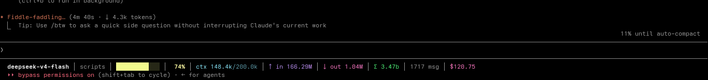
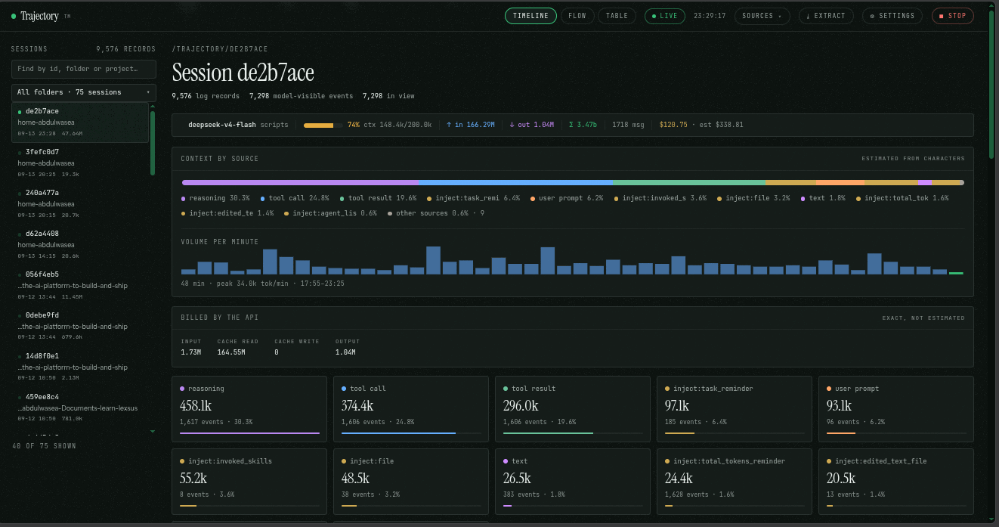
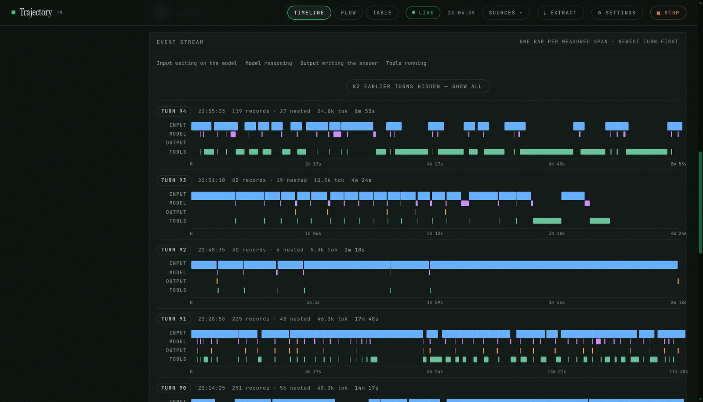

# traj-claude

Two small tools for **Claude Code** — plain Python 3.8+, no dependencies, on
Linux, macOS and Windows. Neither one sends your data anywhere.

📖 **[Full documentation](https://abdulwasea89.github.io/traj-claude/)** — this
README is the short version.

> **Work in progress.** The status line is finished and in daily use. The
> dashboard runs and is usable but is still changing — there is no packaging
> and no test suite yet. Everything below works today.

---

## Features

**Status bar**
- Model, project, a colour-shifting context bar and percent
- Cumulative input/output tokens, all-time total, message count
- Derived session cost, with three fallbacks if the gateway doesn't report one

**Dashboard**
- Every token in your context window, broken down by source and by turn
- A per-minute volume chart and a four-lane event stream (Input / Model /
  Output / Tools)
- Timeline, Flow and Table views, six colour palettes, and a Settings page
  with 140 knobs
- Terminal report and static HTML export, for use over SSH or in a bug report

| | |
|---|---|
| **[`statusline/`](statusline/)** | the status bar |
| **[`dashboard/`](dashboard/)** | the local dashboard |

---

## Installation

Clone once. Both tools run from the checkout; there is no build step and
nothing to `pip install`.

```sh
git clone https://github.com/abdulwasea89/traj-claude.git
cd traj-claude
```

### Status bar

```sh
cd statusline
python3 install.py          # on Windows: python install.py
```

Then **restart Claude Code** — the status line is read once, at startup.

The installer copies `statusline-command.py` into your Claude Code directory
and points `statusLine` at it in `settings.json`. It backs that file up first
and touches only the one key — see
[exactly what it writes](statusline/README.md#what-it-does-to-your-settings).

It's a copy, not a link, so re-run `install.py` after a `git pull`.
`--uninstall` removes the `statusLine` key but leaves the copy in place.

```sh
python3 install.py --dry-run          # show what would change, write nothing
python3 install.py --uninstall        # remove the statusLine entry again
python3 install.py --python /usr/bin/python3.12
```

### Dashboard

There is nothing to install. It reads the transcripts Claude Code already
writes, at `~/.claude/projects/*/*.jsonl`.

```sh
cd dashboard
python3 trajectory.py serve       # http://127.0.0.1:8788 — Ctrl-C to stop
```

`python3 trajectory.py` on its own starts the same server in the background
and prints the address, so your shell comes straight back. It binds to
`127.0.0.1` only: the transcript holds your prompts, your code and your file
paths, so it never touches the network.

### Requirements

| | |
|---|---|
| **Python** | 3.8 or newer — `python3 --version` |
| **Dependencies** | none, and that's a constraint rather than luck |
| **Platform** | Linux, macOS, Windows |
| **Reads** | `~/.claude/projects/*/*.jsonl` and `stats-cache.json` |
| **Writes** | the status line's cache in `~/.cache/claude-statusline`, the dashboard's `dashboard/trajectory.config.json`, and — only from `install.py` — one key of `~/.claude/settings.json` |

---

## Usage

### Status bar

Claude Code reserves one row at the bottom of the terminal. This fills it:


And the same bar, on its own:



#### Fields

| field | meaning |
|---|---|
| `deepseek-v4-flash` | the model serving this session |
| `scripts` | the project directory you're in |
| `███████░░░` | context window used, colour-shifting green → yellow → orange → red |
| `74%` | the same thing as a number |
| `ctx 148.4k/200.0k` | tokens currently in the window, over your configured limit |
| `↑ in 166.29M` | **cumulative** input: fresh input + cache reads + cache writes, all session |
| `↓ out 1.04M` | cumulative output tokens this session |
| `Σ 3.47b` | all-time tokens across every session, from Claude Code's own `stats-cache.json` |
| `1717 msg` | your prompts plus the model's replies, this session |
| `$120.75` | session cost, derived — see below |

Fields drop out rather than showing a placeholder when they aren't available:
with no transcript yet you get the bar, `0%`, and `no transcript yet`.

#### Configuration

Set these as environment variables. Under Claude Code, the reliable place is
the `env` block of `settings.json`:

| variable | default | effect |
|---|---|---|
| `CLAUDE_CONTEXT_LIMIT` | `200000` | input context window in tokens — **set this to your model's real window** or the percentage is wrong |
| `CLAUDE_BAR_WIDTH` | `12` | width of the progress bar in cells |
| `CLAUDE_SHOW_PROJECT` | `1` | `0` hides the project name |
| `CLAUDE_EXACT` | `0` | `1` prints `3,431,260` instead of `3.43M` |
| `CLAUDE_COST_IN` / `_OUT` / `_CACHE_READ` / `_CACHE_WRITE` | — | USD per 1M tokens, per kind — see **where the cost comes from**, below |
| `CLAUDE_QUOTA_PER_USD` | `500000` | quota units per dollar, for gateways that report cost that way |
| `CLAUDE_STATUSLINE_CACHE` | `~/.cache/claude-statusline` | where the scan cache, and the cached gateway pricing, live |
| `CLAUDE_CONFIG_DIR` | `~/.claude` | Claude Code's directory, if you've moved it |

#### Where the cost comes from

Three sources, in order of preference:

1. **Claude Code's own figure**, if the gateway reports a non-zero one. Many
   report zero.
2. **Your rates**, if any `CLAUDE_COST_*` is set.
3. **The gateway's published model ratios**, fetched once from
   `<ANTHROPIC_BASE_URL>/api/pricing` and cached on disk for a day. This sends
   nothing about you or your session — it's a plain `GET` for a price list.

If none of the three yields a number, the field is omitted rather than
guessed. Watch out for the gateway's ratios in particular: they're published
rates for a model, not what you were actually billed — which is why the
dashboard labels the same figure *estimated*.

Costs, every field, and troubleshooting:
**[statusline/README.md](statusline/README.md)**.

### Dashboard

The transcript Claude Code writes contains everything the model saw. This
reads it and shows you the shape of it — and answers the question the
transcript makes surprisingly hard: *what's actually in my context window,
and when did it get there?*



Every session on disk down the left, the current one's header and status line
across the top, then the context window broken down by source, a per-minute
volume chart, the usage the API actually billed, and one tile per source.
Every token in the window has an owner.



Under the header is the **event stream**. Each turn is one row, split into
four lanes:

| lane | what it measures |
|---|---|
| **Input** | waiting on the model |
| **Model** | it reasoning |
| **Output** | it writing the answer |
| **Tools** | tools running |

A lane is read off what the span points at, so the width of a turn tells you
how much of it was waiting on the model, how much was thinking, how much was
writing, and how much was tools running. A turn that took four minutes and a
turn that took four minutes and nineteen tool calls look identical in a
transcript — and completely different here. Hover any bar for the span it
covers; click one for the full record.

#### Three views and two pages

- **Timeline** — the event stream, plus the per-source breakdown and one tile
  per source: tokens, events and share of the window. Click a tile to filter
  every view to it.
- **Flow** — the session as nested steps, with each tool call paired to the
  result it produced.
- **Table** — every event, in order, filterable and expandable.

Plus a **Settings** page (140 knobs in sixteen groups, every one of which
changes real behaviour) at `/settings`, and an **Extract** page at `/extract`
that writes the current view to JSON, Markdown or CSV. Both are pages in
their own right — their own address and their own title, the session's view
tabs and source filter come off the nav while one is open, and Back returns
you to the session rather than out of the dashboard. The brand in the corner
links back.

#### Six palettes

Under Settings → Appearance → Palette. Five are `DESIGN.md`'s own stocks, and
**midnight** — the doc's green-cast near-black — is the default:

| | |
|---|---|
| **midnight** | the doc's green-cast near-black, declared in OKLCH — the default |
| **light** | warm off-white, the other end of that same ramp |
| **dark** | warm charcoal |
| **solarized** | the classic Solarized sand, with its signature blue |
| **oled** | true `#000000`, neon cyan accent |
| **paper** | this dashboard's own warm off-white |

**Accent colour.** A palette brings the accent `DESIGN.md` pairs with it — a
lighter green on the dark stocks, because a 0.52 green sinks into a 0.16
background. Pick an accent by hand and it survives every switch: a palette
only claims the accent while it's still the one the last palette put there. A
palette name from an older build (`ink`, `green`) reads as the stock it
became, rather than resetting to paper.

**Contrast.** Text clears AA (4.5:1) on **light, dark, midnight and oled**.
The small voices — the 9.5px labels, the timestamps, the `--faint` ramp — are
what that's measured against, and two stocks needed work to get there:
midnight's and dark's `--faint` were under 4.5:1, and oled's ramp was one
step too light. `paper` is left exactly as it was, so its `--faint` still
measures 2.8:1. `solarized` is the one palette that can't get there without
ceasing to be Solarized: base2 is only 1.13:1 from base3, so nothing clears
AA on a base2 card, and the two secondary voices are read off Solarized's own
blue-grey hue at the lightest steps that do. Its signature blue is left
alone, so it reads at about 3.2:1 as 10px text.

**Hairlines** aren't a grey at all: they're the stock's foreground at 10% and
5%, the derivation `DESIGN.md` calls for, so they read as a line rather than
as green on black. **Hairline strength** in Settings scales them, 100 being
the doc's 10%, 0 removing every line.

**Source colours.** A source colour is a saved setting, and its default was
picked against paper's light ground: a bar that reads at one lightness there
sinks into a near-black one. So the page never draws a source colour raw — it
draws that colour at the lightness the current stock asks for, same hue,
lightness lifted 1.38× and chroma 1.12×. The 1.38 is the ratio `DESIGN.md`
itself uses between a stock's accent and its dark-stock version; the chroma
comes up a little with the lightness, because raising lightness alone washes
a colour towards grey. A bar, a dot, a table rail and a label that speak in
that colour are all one value, so a colour you pick in Settings moves all of
them. The three light stocks draw the settings' exact values.

**Scrollbars** come from the palette too: thin, the stock's accent at 45%,
on a transparent track that lets the panel show through. It's the standard
`scrollbar-width`/`scrollbar-color` pair doing the work rather than
`::-webkit-scrollbar`, because that's what actually renders — a 14px
`::-webkit-scrollbar` rule leaves the bar at the platform's 15px here, while
`scrollbar-width: thin` takes it to 10. The pseudo-elements stay for older
Blink, which knows only those. This also fixed the page's own scrollbar,
which was coloured from `--bg-3` on `html`: the themes declare that token on
`body`, so on `html` it fell back to paper's light value and drew a green bar
down the side of every dark stock.

Its settings live in `dashboard/trajectory.config.json`, next to the script.
It's written on the first change you make, or on the first page load that
has a migration to record. **It never writes to `~/.claude/settings.json`.**

### Advanced

**The terminal report.** `--text` renders the same numbers as the page, as
text — useful over SSH, or in a script.

```sh
python3 trajectory.py --text
python3 trajectory.py --text --limit 100 --source reasoning
python3 trajectory.py --all            # the 40 most recent sessions
python3 trajectory.py de2b7ace         # one session, by id or id-prefix
```

`--limit` applies to the text report only; `--html` writes the whole session
regardless.

**A static snapshot.** `--html` writes a single self-contained file — no
server, no live updates. That's what you want when attaching it to a bug
report rather than watching it.

```sh
python3 trajectory.py --html --out session.html
```

**A different port, or a different Claude Code directory.** Both tools read
`CLAUDE_CONFIG_DIR`, so you can point them at a copied directory and analyse
a transcript from another machine without touching your own:

```sh
python3 trajectory.py serve --port 9000
CLAUDE_CONFIG_DIR=/mnt/backup/claude python3 trajectory.py --all
```

**The config file.** Every knob in Settings is in
`dashboard/trajectory.config.json`, keyed by the name the page shows. Delete
the file and the dashboard comes back up on its defaults. A knob that doesn't
change real behaviour is a bug, not a placeholder.

**Everything else** — the full command line, the server knobs, where each
tool stores things, and troubleshooting:
**[abdulwasea89.github.io/traj-claude](https://abdulwasea89.github.io/traj-claude/)**.

---

## How the numbers work

Claude Code's transcript writes each assistant message about 2.5× as
streaming snapshots, each with a byte-identical copy of the same `usage`
object. Summing every record inflates your totals by that factor — which is
where a lot of "I used 3 million tokens?" comes from.

The status line deduplicates by `message.id`, and user records by `uuid`. The
dashboard deduplicates by `message.id` too, but not by user `uuid` — it takes
each user record as one event. The details, including the byte-offset cache
that makes re-counting cheap, are in the docstring at the top of
`statusline/statusline-command.py`.

Page-level sizes are a different thing: those are characters, not tokens,
and are estimated so that sources are comparable with each other. The
session's real billed usage is reported separately and is never an estimate.

---

## Troubleshooting

**The bar doesn't appear.** Run it by hand — a status line that crashes
prints nothing, which looks identical to one that was never configured:

```sh
echo '{"model":{"display_name":"test"},"cwd":"/tmp"}' | python3 ~/.claude/statusline-command.py
```

It should print a bar. If it doesn't, the `statusLine` entry isn't in
`settings.json`, or `CLAUDE_CONFIG_DIR` points somewhere else.

**The percentage is wrong.** `CLAUDE_CONTEXT_LIMIT` defaults to `200000`. If
your model's window is a different size, the bar and the percent are both
scaled wrong.

**It's slow.** The first render on a long session scans the whole
transcript; after that it reads only the bytes appended since. Delete
`~/.cache/claude-statusline` to force a full rescan.

**Cost shows `$0.00` or nothing at all.** No rates are set, or the gateway
reports its own cost as zero — many do. Supply `CLAUDE_COST_*` and the figure
is derived from token counts instead.

**The dashboard says no transcript found.** It looks under
`$CLAUDE_CONFIG_DIR/projects` (`~/.claude/projects` by default). If that
directory is empty, Claude Code hasn't written a session there yet.

---

## Contributing

Issues and pull requests are both welcome — the project is small enough that
there's no process to learn. A few things make a change easy to take:

- **Open an issue first for anything structural.** The dashboard is still
  changing shape, and it's cheaper to agree on the shape before either of us
  writes it.
- **Standard library only.** No `pip install` for anyone, and no dependency
  to audit.
- **Keep the tokens in one place.** A colour or a size is a token in the
  stylesheet or a knob in `trajectory.py`'s `CONFIG_SPEC`, never a literal in
  a component. Every knob names the custom property it writes (`cssvar`) or
  the `data-` attribute it sets (`attr`), so the control and the thing it
  moves are one line apart rather than two lists that drift apart.
- **Say what you measured.** If a change is about contrast, speed or size,
  put the before-and-after numbers in the pull request. "Looks better" is
  hard to review; "2.76:1 → 4.61:1 on the 9.5px label" is not.
- **Test on a light stock and a dark one.** Almost every layout bug in this
  project so far has appeared on one and not the other.

The docs site under `docs/` is one self-contained HTML file and a folder of
screenshots — no build step. Edit it and push; the [Pages
workflow](.github/workflows/pages.yml) checks that every image it references
exists and then publishes it.

---

## Project layout

```
statusline/
  statusline-command.py   the bar itself — reads the Claude Code JSON on stdin
  install.py              cross-platform installer for settings.json
  README.md               what each field means, every env knob, troubleshooting
dashboard/
  trajectory.py           transcript parsing, the terminal report, `serve`,
                          CONFIG_SPEC (every setting), and the HTTP server
  trajectory_dashboard.py the page — waterfall, flow, table, settings, extract
docs/
  index.html              the documentation site
  img/                    its screenshots
```

Both dashboard files are large single files on purpose: the page is one
embedded string, so there's no build step and nothing between `git clone`
and a running dashboard.

## Licence

MIT. See [LICENSE](LICENSE).
